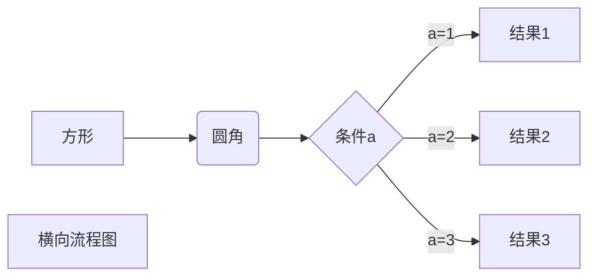

# Markdown 学习笔记

## 标题

标题一般用`# `开头，1~6个`# `分别表示1~6级标题

## 字体

- 斜体一个`*`或`_`  *斜体*

- 粗体两个`*`或`_ `**粗体**

- 粗斜体三个`*`或`_`  ***粗斜体***

## 分割线

三个或以上的`*` 或`-` 

*****

----------

## 删除线

两个`~~` ~~~~删除线~~~~

## 下划线

用html标签<u></u>

<u>下划线</u>

## 脚注

中括号包裹，里面^开头，中括号后面：加内容

我的代码可以在Github[^GitHub]上进行克隆

[^GitHub]:Github俗称GayClub,是大型基友社交平台

## 列表

- 无序列表

无序列表使用`*` `+` `-` 都可以

- 有序列表

有序列表使用数字加小数点 `.`

- 列表嵌套

子列表前加四个空格

1. 第一项

   这里都是水果

   - 菠萝
   - 芒果
   - 西瓜

1. 第二项

   这里都是蔬菜

   - 菠菜
   - 胡萝卜
   - 西红柿

## 区块

- 区块引用

区块引用使用`>`

> 这个世上本没有路，走的人多了，也便成了路  --鲁迅


- 区块嵌套

> 我是爸爸
>
> > 我是儿子
> >
> > > 我是孙子...


- 列表和区块相互嵌套

1. 区块中使用列表

> 鲁迅说他喜欢吃这些：
>
> 1. 蔬菜
>    - 胡萝卜
>    - 马铃薯
>    - 西红柿
> 2. 水果
>    - 西瓜
>    - 菠萝
>    - 香蕉

2. 列表中使用区块

- 第一

  > 我没说过这些话 --鲁迅

- 第二

  > 你们要抓的人是鲁迅，关我周树人什么事儿？ 

  

## 代码

- 如果是段落上的某个片段，可以用一个`` ` ``包裹

- 代码区块可以使用四个` `   或者一个`tab`

- 代码块用三个`` ` ``包裹，前面的````` ``紧跟语言

```python
# python code 
print('hello,world')
```

```javascript
//javascript
const hello_world = 'hello,world';
console.log(hello_world);
```

## 链接

``` [链接名称](链接地址)```或者`<链接地址>`

高级链接

如果有两个`[]`，如`[Github][github]`,则后面是作为链接的变量名，具体的链接可以在文章最后再指定，指定的方式是`[github]:https://github.com`

例子：

详情请访问[GitHub][github]哦~

[github]:https://github.com


## 图片

图片和链接类似，语法为``

这是一张图片

另一种方法是使用HTML的`img`标签，它可以指定图片的宽高

我（``）可以让图片缩小到四分之一


## 表格

在表格中，使用`|`分割纵向单元格，使用`-`分割表头和剩余单元格


| 英雄   | 一技能       | 二技能       | 三技能       |
| ------ | ------------ | ------------ | ------------ |
| 王昭君 | **凋零冰晶** | **禁锢寒霜** | **凛冬已至** |
| 吕布   | **方天画斩** | **贪狼之握** | **魔神降世** |
| ...    | ...          | ...          | ...          |

- 对齐方式

1. 左对齐`:-`
2. 右对齐`-:`
3. 居中对齐`:-:`

|左对齐|居中对齐|右对齐|
|:-----|:--------:|---------:|
|一|二|三|

## 进阶

- 支持某些HTML元素

支持的 HTML 元素有：`<kbd> <b> <i> <em> <sup> <sub> <br>`等

- 转义
- 公式
- 画图

```sequence
对象A->对象B: 对象B你好吗?（请求）
Note right of 对象B: 对象B的描述
Note left of 对象A: 对象A的描述(提示)
对象B-->对象A: 我很好(响应)
对象A->对象B: 你真的好吗？
```



-------

未完待续......
